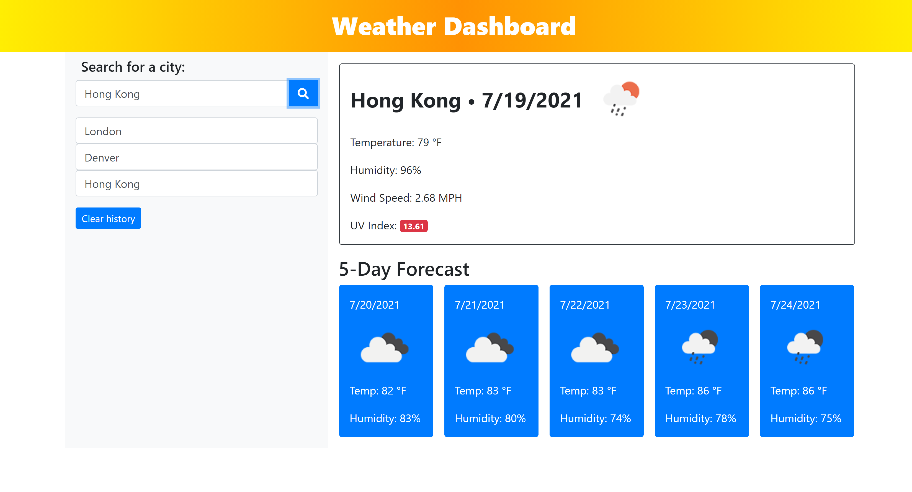

# ☔06-Weather-Dashboard🌈


Using a third-party API, I built a weather dashboard that runs in the browser and feature dynamically updated HTML and CSS.


📃Deployed Github Page: https://hrdowell.github.io/06-Weather-Dashboard/ 


📂Github Repository: https://github.com/hrdowell/06-Weather-Dashboard


👩‍💻My Profile: https://github.com/hrdowell


### 📆User Story

```md
AS A traveler
I WANT to see the weather outlook for multiple cities
SO THAT I can plan a trip accordingly
```


### 🌄Acceptance Criteria

```md
GIVEN a weather dashboard with form inputs
WHEN I search for a city
THEN I am presented with current and future conditions for that city and that city is added to the search history
WHEN I view current weather conditions for that city
THEN I am presented with the city name, the date, an icon representation of weather conditions, the temperature, the humidity, the wind speed, and the UV index
WHEN I view the UV index
THEN I am presented with a color that indicates whether the conditions are favorable, moderate, or severe
WHEN I view future weather conditions for that city
THEN I am presented with a 5-day forecast that displays the date, an icon representation of weather conditions, the temperature, the wind speed, and the humidity
WHEN I click on a city in the search history
THEN I am again presented with current and future conditions for that city
```


### 🌞My Process

For this project, I primarily used the Open Weather Map data API and the js Date object to make my application.

In the JavaScript, I had to do a lot of manipulation of the get request response in order to display the correct weather information. For example, the initial search based on city name returns latitude and longitude coordinates, and these coordinates are used in the UV Index get request.

To display the dates along with the current forecasts, I used the timestamp returned from the Open Weather Map response and converted it into a date. Then, I used the getDate🕥, getMonth📆, and getFullYear📅 methods to create the date data strings that are on displayed throughout the application.

I used bootstrap to style the page and added a "Clear History"❌ button displayed underneath the search history list that clears the local storage along with the corresponding city names displayed underneath the search button.


## ⚡ The Final Product

GIF Recording of Deployed Application:


Screenshot of Deployed Application:

